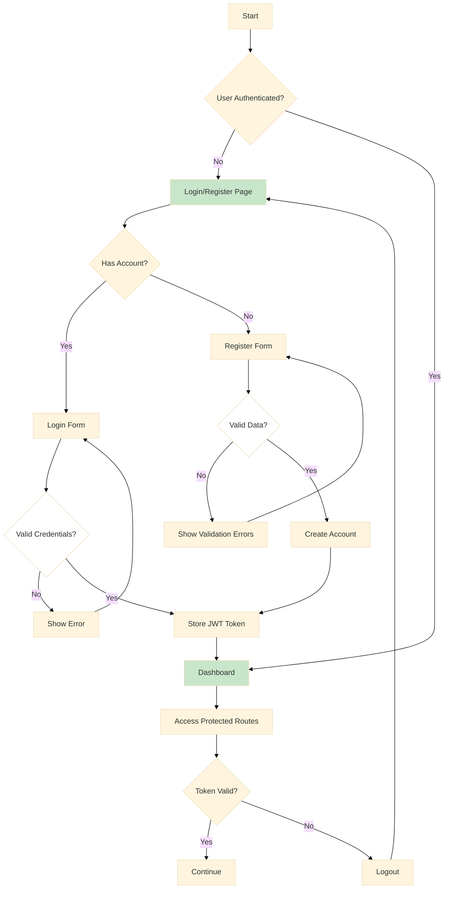

# 🍽️ Stockee. - Inventory Management System

## 🖼️ Project Showcase
<br/>
<p align="center">
  
  
  

</p>
<p align="center">
  
  
  
</p>


## 🎯 About the Project

**Stockee** is a modern web application designed for comprehensive inventory, order, and waste management in restaurants. The platform empowers users to:

- 📦 Manage ingredient inventory in real-time
- 📊 Visualize consumption metrics and trends
- 🛒 Automate order recommendations
- 📈 Analyze operational efficiency and waste
- 🔍 Generate detailed performance reports

Built with React and Material-UI, Stockee provides an intuitive interface for restaurant managers to optimize their operations, reduce waste, and improve profitability.

## ✨ Key Features

### 1. **Interactive Dashboard**
- Real-time key metrics visualization
- Consumption trend charts
- Operational efficiency indicators
- Low stock alerts

### 2. **Inventory Management**
- Full CRUD operations for ingredients
- Current and minimum stock control
- Automatic alert system
- Advanced filtering and search

### 3. **Order System**
- Automatic recommendations based on consumption
- Order history
- Intelligent quantity adjustment
- Custom manual orders

### 4. **Efficiency Analysis**
- Waste registration with categorization
- Waste type charts
- Product efficiency analysis
- Temporal trends

### 5. **Secure Authentication**
- Login/registration system
- JWT token-based authentication
- Protected routes
- Session management

## 🛠️ Tech Stack

### Frontend Core
- **React 18.3.1** - UI library
- **Vite 5.4.10** - Build tool and dev server
- **React Router DOM 7.0.1** - Navigation and routing
- **Axios 1.7.7** - HTTP client for API calls

### UI/UX
- **Material-UI (MUI) 6.1.7** - UI components
- **MUI X-Charts 7.22.1** - Data visualization
- **Lucide React 0.454.0** - Icon library
- **CSS3** - Custom styling

### Testing
- **Vitest 2.1.4** - Testing framework
- **React Testing Library 16.0.1** - Component testing
- **jsdom 25.0.1** - Virtual DOM for tests

### Development Tools
- **ESLint** - Code linter
- **@vitejs/plugin-react 4.3.3** - React plugin for Vite

## 🚀 Getting Started

### Prerequisites

- **Node.js** >= 18.0.0
- **npm** >= 9.0.0 or **yarn** >= 1.22.0
- **Backend API** running on `http://localhost:8080`

### Installation

1. **Clone the repository**
```bash
git clone https://github.com/your-username/stockee-frontend.git
cd stockee-frontend
```

2. **Install dependencies**
```bash
npm install
# or
yarn install
```

3. **Configure environment variables**
```bash
cp .env.example .env
```

Edit `.env` with your configuration:
```env
VITE_API_URL=http://localhost:8080
VITE_APP_NAME=Stockee
```

4. **Start development server**
```bash
npm run dev
# or
yarn dev
```

The application will be available at `http://localhost:5173`

### Build for Production

```bash
npm run build
# or
yarn build
```

Optimized files will be generated in the `dist/` folder.

## 👤 User Flow

```mermaid
%%{init: {'theme': 'forest'}}%%

graph TB
    Start([User Opens App<br/>Already Authenticated]) --> Dashboard[Dashboard Page]
    
    Dashboard --> DashboardActions{User Action}
    
    DashboardActions -->|View Charts| ViewCharts[View Consumption Trends<br/>Top Ingredients<br/>Low Stock<br/>Efficiency Gauges]
    DashboardActions -->|Navigate| NavStock[Go to Stock]
    DashboardActions -->|Navigate| NavOrders[Go to Orders]
    DashboardActions -->|Navigate| NavAnalytics[Go to Analytics]
    
    ViewCharts --> Dashboard
    
    %% STOCK FLOW
    NavStock --> StockPage[Stock Management Page]
    StockPage --> StockActions{User Action}
    
    StockActions -->|View| ViewStock[View Inventory List<br/>Current Stock<br/>Minimum Stock<br/>Status]
    StockActions -->|Search/Filter| FilterStock[Filter by Status<br/>Search by Name]
    StockActions -->|Add| AddIngredient[Click Add Button]
    StockActions -->|Edit| EditIngredient[Click Edit Icon]
    StockActions -->|Delete| DeleteIngredient[Click Delete Icon]
    StockActions -->|Back| Dashboard
    
    ViewStock --> StockActions
    FilterStock --> ViewStock
    
    AddIngredient --> AddModal[Open Add Ingredient Modal]
    AddModal --> FillAdd[Fill Form:<br/>Name<br/>Current Stock<br/>Minimum Stock<br/>Unit]
    FillAdd --> ValidateAdd{Valid<br/>Form?}
    ValidateAdd -->|No| AddError[Show Validation Errors]
    ValidateAdd -->|Yes| SubmitAdd[Submit to API]
    AddError --> FillAdd
    SubmitAdd --> AddSuccess{Success?}
    AddSuccess -->|Yes| RefreshStock[Refresh Stock List]
    AddSuccess -->|No| AddAPIError[Show API Error]
    RefreshStock --> StockPage
    AddAPIError --> AddModal
    
    EditIngredient --> EditModal[Open Edit Modal<br/>with Pre-filled Data]
    EditModal --> FillEdit[Modify Form Data]
    FillEdit --> ValidateEdit{Valid<br/>Form?}
    ValidateEdit -->|No| EditError[Show Validation Errors]
    ValidateEdit -->|Yes| SubmitEdit[Submit Update to API]
    EditError --> FillEdit
    SubmitEdit --> EditSuccess{Success?}
    EditSuccess -->|Yes| RefreshStock
    EditSuccess -->|No| EditAPIError[Show API Error]
    EditAPIError --> EditModal
    
    DeleteIngredient --> ConfirmDelete[Show Confirmation Dialog]
    ConfirmDelete --> DeleteDecision{Confirm?}
    DeleteDecision -->|No| StockActions
    DeleteDecision -->|Yes| SubmitDelete[Delete via API]
    SubmitDelete --> DeleteSuccess{Success?}
    DeleteSuccess -->|Yes| RefreshStock
    DeleteSuccess -->|No| DeleteError[Show Error Message]
    DeleteError --> StockActions
    
    %% ORDERS FLOW
    NavOrders --> OrdersPage[Orders Management Page]
    OrdersPage --> OrderTabs{Select Tab}
    
    OrderTabs -->|Recommended| AutoOrders[Auto-Recommended Orders Tab]
    OrderTabs -->|History| OrderHistory[Order History Tab]
    
    AutoOrders --> LoadRecommendations[Load AI Recommendations<br/>Based on:<br/>- Current Stock<br/>- Minimum Stock<br/>- Consumption Patterns]
    LoadRecommendations --> OrderActions{User Action}
    
    OrderActions -->|View| ViewRecommendations[View Recommended Items<br/>Quantities<br/>Priority Levels]
    OrderActions -->|Adjust| AdjustQuantities[Modify Quantities<br/>- Individual Items<br/>- Global Adjustment]
    OrderActions -->|Add Manual| AddManualOrder[Click Add Manual Item]
    OrderActions -->|Complete| CompleteOrder[Click Complete Order]
    OrderActions -->|Back| Dashboard
    
    ViewRecommendations --> OrderActions
    AdjustQuantities --> ViewRecommendations
    
    AddManualOrder --> ManualModal[Open Add Order Modal]
    ManualModal --> SelectIngredient[Select Ingredient<br/>from Dropdown]
    SelectIngredient --> EnterQuantity[Enter Quantity]
    EnterQuantity --> ValidateManual{Valid<br/>Data?}
    ValidateManual -->|No| ManualError[Show Validation Error]
    ValidateManual -->|Yes| AddToOrder[Add to Manual Orders]
    ManualError --> EnterQuantity
    AddToOrder --> OrderActions
    
    CompleteOrder --> ConfirmOrder[Show Order Summary]
    ConfirmOrder --> OrderConfirm{Confirm<br/>Order?}
    OrderConfirm -->|No| OrderActions
    OrderConfirm -->|Yes| SubmitOrder[Submit Order to API]
    SubmitOrder --> OrderSubmitSuccess{Success?}
    OrderSubmitSuccess -->|Yes| UpdateStock[Backend Updates Stock<br/>Automatically]
    OrderSubmitSuccess -->|No| OrderSubmitError[Show Error Message]
    UpdateStock --> RefreshOrderHistory[Refresh Order History]
    RefreshOrderHistory --> OrderSuccess[Show Success Message<br/>Clear Order Lists]
    OrderSuccess --> OrdersPage
    OrderSubmitError --> OrderActions
    
    OrderHistory --> ViewHistory[View Past Orders<br/>- Date<br/>- Items Count<br/>- Details]
    ViewHistory --> OrdersPage
    
    %% ANALYTICS FLOW
    NavAnalytics --> AnalyticsPage[Analytics & Efficiency Page]
    AnalyticsPage --> LoadAnalytics[Load Analytics Data:<br/>- Efficiency Stats<br/>- Waste Data<br/>- Charts<br/>- Product Efficiency]
    LoadAnalytics --> AnalyticsActions{User Action}
    
    AnalyticsActions -->|View Stats| ViewStats[View Statistics Cards:<br/>- Overall Efficiency<br/>- Total Waste<br/>- Cooking Errors<br/>- Expired Products]
    AnalyticsActions -->|View Charts| ViewChartAnalytics[View Charts:<br/>- Waste Types Pie Chart<br/>- Waste Trend Chart]
    AnalyticsActions -->|View Table| ViewEfficiency[View Product Efficiency:<br/>- Efficiency %<br/>- Main Waste Cause<br/>- Loss Amount]
    AnalyticsActions -->|Register Waste| RegisterWaste[Click Register Waste]
    AnalyticsActions -->|View List| ViewWasteList[View Waste History List]
    AnalyticsActions -->|Delete Waste| DeleteWaste[Click Delete Waste]
    AnalyticsActions -->|Back| Dashboard
    
    ViewStats --> AnalyticsActions
    ViewChartAnalytics --> AnalyticsActions
    ViewEfficiency --> AnalyticsActions
    ViewWasteList --> AnalyticsActions
    
    RegisterWaste --> WasteModal[Open Waste Registration Modal]
    WasteModal --> FillWaste[Fill Form:<br/>- Select Product<br/>- Enter Quantity<br/>- Select Reason<br/>burned/expired/damaged<br/>- Add Details]
    FillWaste --> ValidateWaste{Valid<br/>Form?}
    ValidateWaste -->|No| WasteError[Show Validation Errors]
    ValidateWaste -->|Yes| SubmitWaste[Submit Waste to API]
    WasteError --> FillWaste
    SubmitWaste --> WasteSuccess{Success?}
    WasteSuccess -->|Yes| UpdateStockWaste[Backend Reduces Stock<br/>Automatically]
    WasteSuccess -->|No| WasteAPIError[Show API Error]
    UpdateStockWaste --> RefreshAnalytics[Refresh All Analytics<br/>Components]
    RefreshAnalytics --> AnalyticsPage
    WasteAPIError --> WasteModal
    
    DeleteWaste --> ConfirmDeleteWaste[Show Confirmation Dialog]
    ConfirmDeleteWaste --> DeleteWasteDecision{Confirm?}
    DeleteWasteDecision -->|No| AnalyticsActions
    DeleteWasteDecision -->|Yes| SubmitDeleteWaste[Delete Waste via API]
    SubmitDeleteWaste --> DeleteWasteSuccess{Success?}
    DeleteWasteSuccess -->|Yes| RefreshAnalytics
    DeleteWasteSuccess -->|No| DeleteWasteError[Show Error Message]
    DeleteWasteError --> AnalyticsActions
    
    %% STYLING - Based on Stockeo Color Palette
    %% Primary Colors (#6366f1 - Indigo)
    style Start fill:#c7d2fe,stroke:#3730a3,stroke-width:3px,color:#0D0943
    style Dashboard fill:#6366f1,stroke:#3730a3,stroke-width:3px,color:#ffffff

    
    %% Pages - Primary variations
    style StockPage fill:#C8C9F9,stroke:#6366F1,stroke-width:2px,color:#0D0943
    style OrdersPage fill:#C8C9F9,stroke:#6366F1,stroke-width:2px,color:#0D0943
    style AnalyticsPage fill:#C8C9F9,stroke:#6366F1,stroke-width:2px,color:#0D0943
    
    %% Success States - Secondary Orange
    style RefreshStock fill:#ffedd5,stroke:#ea580c,stroke-width:2px,color:#0D0943
    style UpdateStock fill:#ffedd5,stroke:#ea580c,stroke-width:2px,color:#0D0943
    style UpdateStockWaste fill:#ffedd5,stroke:#ea580c,stroke-width:2px,color:#0D0943
    style RefreshAnalytics fill:#ffedd5,stroke:#ea580c,stroke-width:2px,color:#0D0943
    style OrderSuccess fill:#ffedd5,stroke:#ea580c,stroke-width:2px,color:#0D0943
    
    %% Error States - Tertiary Pink/Red
    style AddError fill:#fdf2f8,stroke:#f472b6,stroke-width:2px,color:#be185d
    style EditError fill:#fdf2f8,stroke:#f472b6,stroke-width:2px,color:#be185d
    style WasteError fill:#fdf2f8,stroke:#f472b6,stroke-width:2px,color:#be185d
    style ManualError fill:#fdf2f8,stroke:#f472b6,stroke-width:2px,color:#be185d
    style AddAPIError fill:#fce7f3,stroke:#ec4899,stroke-width:2px,color:#be185d
    style EditAPIError fill:#fce7f3,stroke:#ec4899,stroke-width:2px,color:#be185d
    style DeleteError fill:#fce7f3,stroke:#ec4899,stroke-width:2px,color:#be185d
    style OrderSubmitError fill:#fce7f3,stroke:#ec4899,stroke-width:2px,color:#be185d
    style WasteAPIError fill:#fce7f3,stroke:#ec4899,stroke-width:2px,color:#be185d
    style DeleteWasteError fill:#fce7f3,stroke:#ec4899,stroke-width:2px,color:#be185d
    
    %% Modals - Neutral tones
    style AddModal fill:#F2F2F2,stroke:#404040,stroke-width:2px,color:#0D0943
    style EditModal fill:#F2F2F2,stroke:#404040,stroke-width:2px,color:#0D0943
    style ManualModal fill:#F2F2F2,stroke:#404040,stroke-width:2px,color:#0D0943
    style WasteModal fill:#F2F2F2,stroke:#404040,stroke-width:2px,color:#0D0943
    
    %% Decision nodes - Primary dark
    style DashboardActions fill:#6366F1,stroke:#6366f1,stroke-width:2px,color:#ffffff
    style StockActions fill:#6366F1,stroke:#6366f1,stroke-width:2px,color:#ffffff
    style OrderActions fill:#6366F1,stroke:#6366f1,stroke-width:2px,color:#ffffff
    style AnalyticsActions fill:#6366F1,stroke:#6366f1,stroke-width:2px,color:#ffffff
```





### Authentication Flow


---

## 🧪 Test


---
## 👥 Authors

- **Paula**  


## 🔗 Related Projects

- **Stockee Backend** - [Backend Repository](https://github.com/Paulafrdz/stockee-backend)
